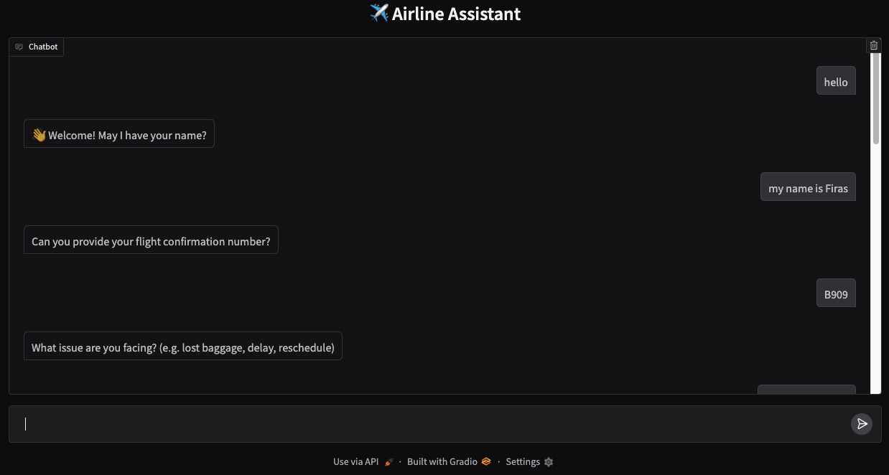
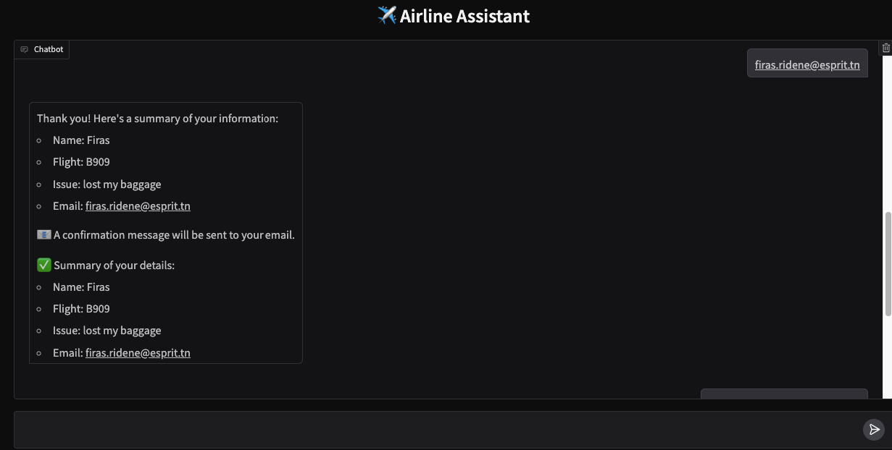
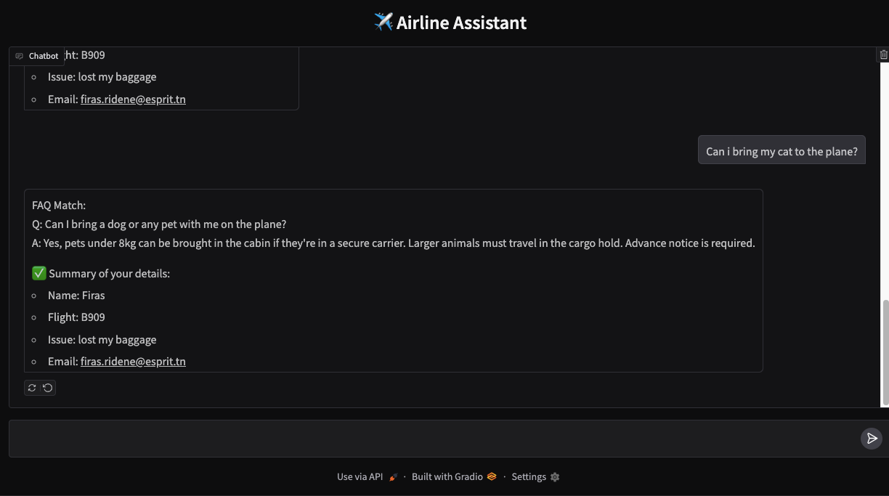

# ✈️ Airline Assistant – GenAI Capstone Project (Kaggle x Google)

  
  


---

## 📌 About This Project

This is a submission for the **Google x Kaggle 5-Day Generative AI Event**.

Our project demonstrates how to build an interactive airline assistant using **Generative AI techniques** including:
- **RAG (Retrieval-Augmented Generation)** for FAQ responses
- **Embeddings-based similarity** using `text-embedding-004`
- **Gemini 2.0 Flash** for intent classification and smart field extraction
- **Multi-turn interaction logic** with **running state**
- A clean **Gradio chat interface**

---

## 🤖 What the Assistant Can Do

The assistant interacts with users just like a real airline support agent:

- 🧠 **Understands your input** using AI-based classification
- 📘 **Answers travel questions** (e.g., "Can I bring a cat on the plane?")
- 🗃️ **Differentiates between FAQ and personal information**
- 📝 **Collects key fields**: name, flight number, issue, and email
- 🧠 **Stores information across turns** using a persistent user state

---

## ⚙️ Setup Instructions (Important!)

To run this notebook, you must add your **Google Generative AI API key**:

1. Go to **"Add-ons" > "Secrets"** (in Kaggle)
2. Add a new secret named:

```
GOOGLE_API_KEY
```

3. Paste your Gemini API key as the value (from https://makersuite.google.com/app/apikey)

---

## 🧠 How It Works

| Component | Description |
|----------|-------------|
| `text-embedding-004` | Generates vector embeddings for FAQ retrieval |
| `cosine similarity` | Finds the best-matching FAQ question |
| `Gemini Flash` | Classifies whether the user input is a question or a personal detail |
| `Field extraction` | AI-based slot-filling logic (e.g., extracting names from messy input) |
| `State tracking` | Stores each user field (name, flight, issue, email) during chat |
| `Gradio` | Provides an interactive chatbot interface for users |

---

## 💡 Why It Matters

This project simulates how a real-world **AI-powered airline assistant** might behave — blending FAQ search with intelligent form-filling, all within a lightweight notebook.

It showcases how we can combine **LLMs, embeddings, and interface tools** to build useful, responsive GenAI apps.

---

## 📁 Files

- `notebook.ipynb` – full interactive assistant
- `assets` – demo pictures


---

## 🙌 Thanks

Huge thanks to **Kaggle**, **Google**, and the GenAI team for organizing the event!

---
